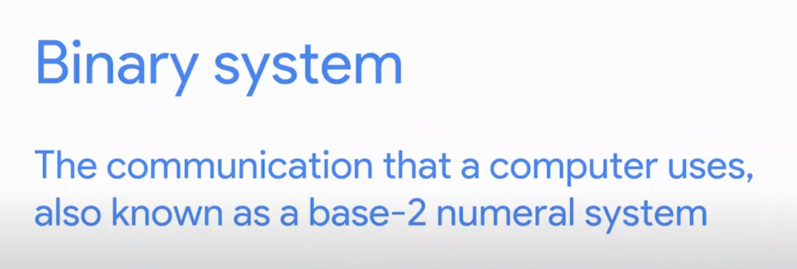
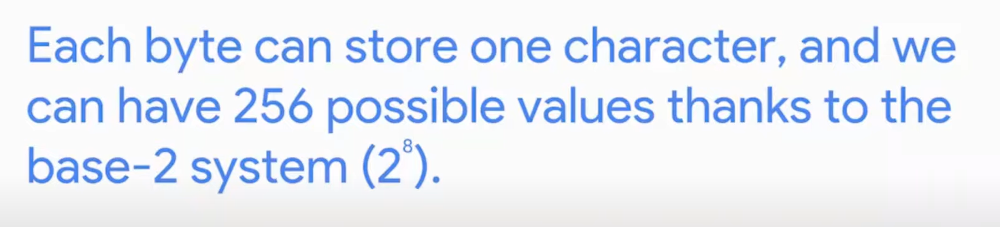

# Study Notes

by Heath Kwak

## Course 1: Technical Support Fundamentals

*Introduction to the IT field, including topics on computer hardware and software, internet, troubleshooting, and customer service.*

#### Intro to IT

​	*Digital Logic: Computer Language*

The computer only talks in 1s and 0s, which is called the **binary system**.

We group binary into 8 numbers or **bits**. A bit is a binary digit. 

Ex. 01100011 01100001 01110100

* A group of 8 bits is referred to as a **byte**.

Notes Time Stamp: 34:27 

Current Time Stamp: 01:23:31
